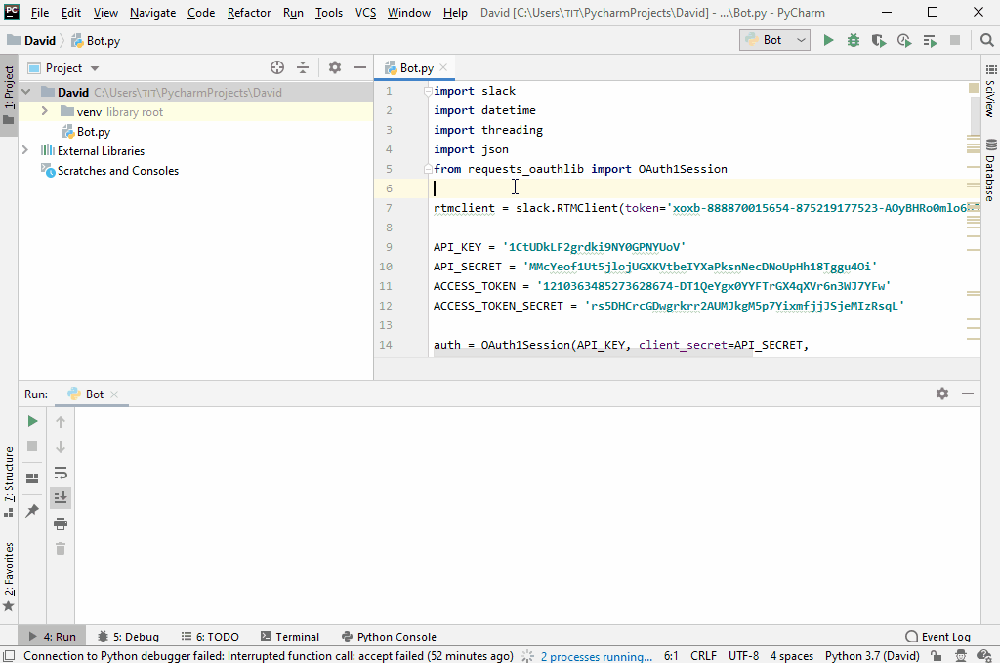

# SlackBot

### Introduction
Slack Bot that posts a message to a defined channel with the current hour,<br>
sent it again every hour and have the following commands:<br>
• 'new-content', which pulls new tweets (all tweets from the last hour) of the following pages:<br>
'Python Weekly', 'Real Python', 'Full Stack Python'.<br>
• 'new-content ***' (with a string), which pulls new tweets from the entered string page.<br>
• 'timenow' - show current time.<br>
• 'tweetnow' - post a new tweet from the channel to a defined user.<br>
• Listen and stream new tweets from a defined user and post them automatically to the channel.


### Prerequisites
* Python interperter
* pip
* IDE - Development envenvironment

### SDK
* slack
* threading
* OAuth1Session
* datetime
* json

### Setup
```javascript
//Clone/Fork the repo

// Go clonned folder
cd SlackBot

// Run server
python SlackBot.py
```

### Demonstration
 > Video Demonstration

